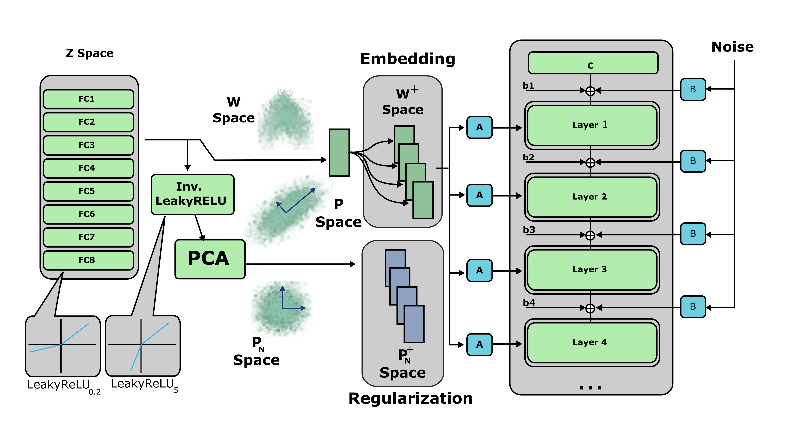

# Improved StyleGAN Embedding: Where are the Good Latents?

[Peihao Zhu](https://github.com/ZPdesu),
[Rameen Abdal](https://github.com/RameenAbdal),
[Yipeng Qin](https://scholar.google.com/citations?user=ojgWPpgAAAAJ&hl=en),
[John Femiani](https://scholar.google.com/citations?user=rS1xJIIAAAAJ&hl=en),
[Peter Wonka](http://peterwonka.net/)<br/>


[arXiv](https://arxiv.org/abs/2012.09036) | [BibTeX](#bibtex) | [Video](https://youtu.be/6grbAFtKvBU)


> **Abstract** StyleGAN is able to produce photorealistic images that are almost indistinguishable from real photos. The reverse problem of finding an embedding for a given image poses a challenge. Embeddings that reconstruct an image well are not always robust to editing operations. In this paper, we address the problem of finding an embedding that both reconstructs images and also supports image editing tasks. First, we introduce a new normalized space to analyze the diversity and the quality of the reconstructed latent codes. This space can help answer the question of where good latent codes are located in latent space. Second, we propose an improved embedding algorithm using a novel regularization method based on our analysis. Finally, we analyze the quality of different embedding algorithms. We compare our results with the current state-of-the-art methods and achieve a better trade-off between reconstruction quality and editing quality.


<p align="center">

</p>

## Description
Official Implementation of "<a href="https://arxiv.org/abs/2012.09036">Improved StyleGAN Embedding: Where are the Good Latents?</a>".


## Getting Started

### Prerequisites
- Linux or macOS
- NVIDIA GPU + CUDA CuDNN
- Python 3

### Installation
- Clone the repository:
``` 
git clone https://github.com/ZPdesu/II2S.git
cd II2S
```
- Dependencies:
We recommend running this repository using [Anaconda](https://docs.anaconda.com/anaconda/install/). 
All dependencies for defining the environment are provided in `environment/environment.yml`.

### Pretrained Models

If the automatic download doesn't work, please download the pre-trained models from the following links.

| Path | Description
| :--- | :----------
|[FFHQ StyleGAN](https://drive.google.com/uc?id=1AT6bNR2ppK8f2ETL_evT27f3R_oyWNHS) | StyleGAN model pretrained on [FFHQ](https://github.com/NVlabs/ffhq-dataset) with 1024x1024 output resolution.
|[Metfaces StyleGAN](https://drive.google.com/uc?id=16wM2PwVWzaMsRgPExvRGsq6BWw_muKbf) | StyleGAN model pretrained on [Metfaces](https://github.com/NVlabs/metfaces-dataset) with 1024x1024 output resolution.
|[AFHQ-Dog StyleGAN](https://drive.google.com/uc?id=16v6jPtKVlvq8rg2Sdi3-R9qZEVDgvvEA) | StyleGAN model pretrained on [AFHQ-Dog](https://github.com/clovaai/stargan-v2) with 512x512 output resolution.
|[AFHQ-Cat StyleGAN](https://drive.google.com/uc?id=1HXLER5R3EMI8DSYDBZafoqpX4EtyOf2R) | StyleGAN model pretrained on [AFHQ-Cat](https://github.com/clovaai/stargan-v2) with 512x512 output resolution.
|[AFHQ-Wild StyleGAN](https://drive.google.com/uc?id=14OnzO4QWaAytKXVqcfWo_o2MzoR4ygnr)) | StyleGAN model pretrained on [AFHQ-Wild](https://github.com/clovaai/stargan-v2) with 512x512 output resolution.
|[Face Landmark Model](https://drive.google.com/uc?id=17kwWXLN9fA6acrBWqfuQCBdcc1ULmBc9) | Face landmark model used in [dlib](http://dlib.net/face_landmark_detection.py.html).

By default, we assume that all models are downloaded and saved to the directory `pretrained_models`.


## Embedding
To embed images, make sure the hyper-parameters are configured in `options/face_embed_options.py`.
Then run the code
```
python main.py --input_dir XXX --output_dir XXX
```

### Different input formats
Please perform the following adjustments in `main.py` to expand the input types.

1. Input folder
```
ii2s.invert_images(image_path=args.input_dir, output_dir=args.output_dir)
```
2. Image path
```
ii2s.invert_images(image_path='input/28.jpg', output_dir=args.output_dir)
```
3. Image path list
```
ii2s.invert_images(image_path=['input/28.jpg', 'input/90.jpg'], output_dir=args.output_dir)
```

### Save output and return latents
To save output and return latent codes, users can make the follwoing adjustments in `main.py`.
```
final_latents = ii2s.invert_images(image_path=args.input_dir, output_dir=args.output_dir, return_latents=True, save_output=True)
```

### Align input images
By default, the input should be aligned images with 1024x1024 resolution. Users can run `align_face.py` to align unprocessed images and save them in another folder, then make the following modifications in `main.py`.

```
final_latents = ii2s.invert_images(image_path=args.input_dir, output_dir=args.output_dir, return_latents=True, save_output=True, align_input=False)
```

We also allow the alignment step during the embedding process.

```
final_latents = ii2s.invert_images(image_path=args.input_dir, output_dir=args.output_dir, return_latents=True, save_output=True, align_input=True)
```

## BibTeX

```
@misc{zhu2020improved,
    title={Improved StyleGAN Embedding: Where are the Good Latents?},
    author={Peihao Zhu and Rameen Abdal and Yipeng Qin and John Femiani and Peter Wonka},
    year={2020},
    eprint={2012.09036},
    archivePrefix={arXiv},
    primaryClass={cs.CV}
}
```
